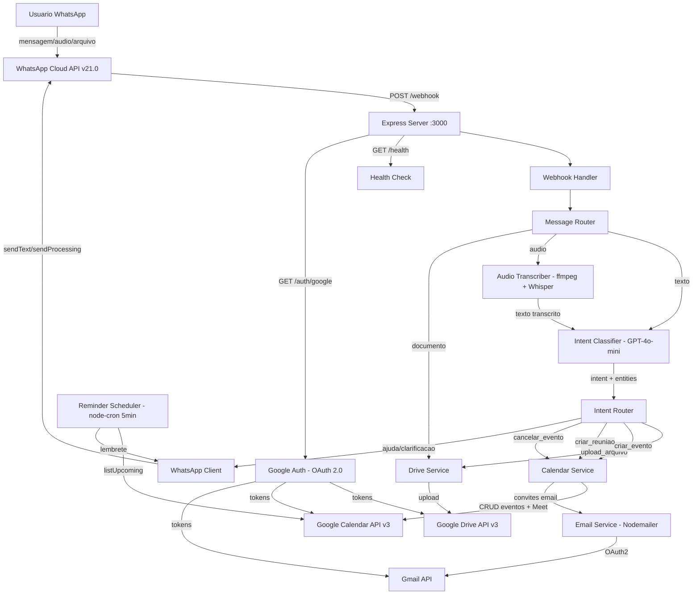
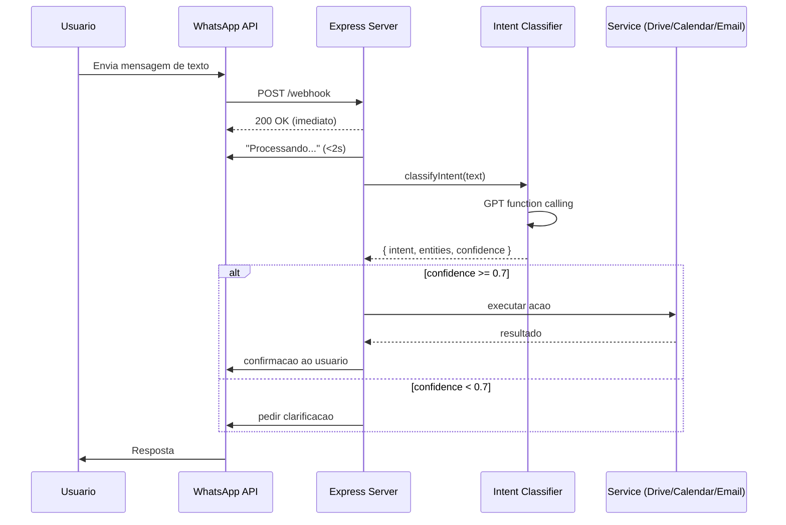
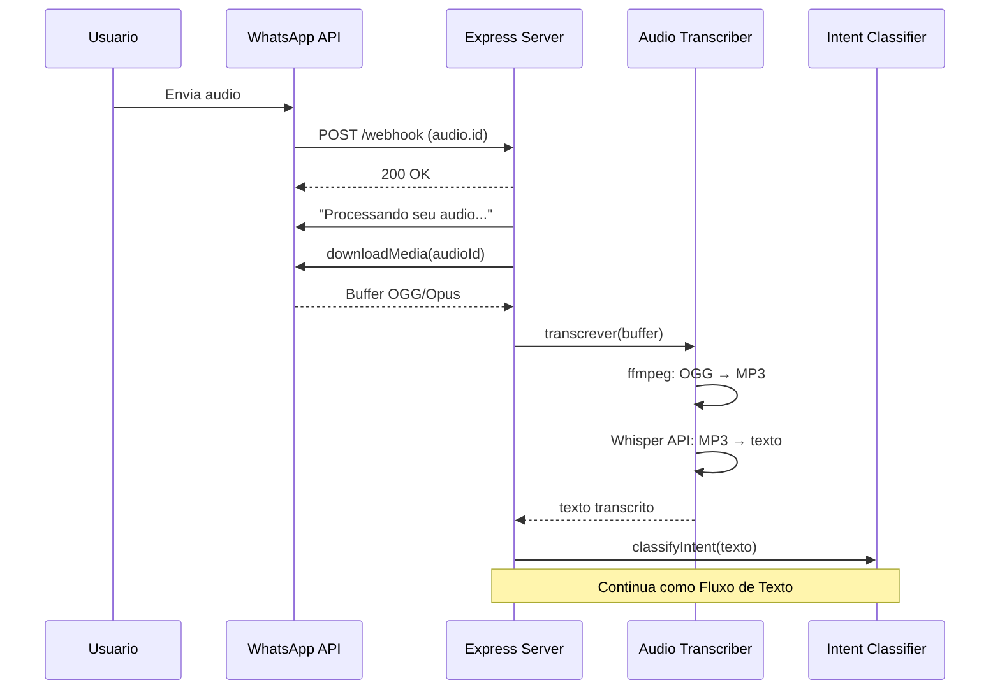
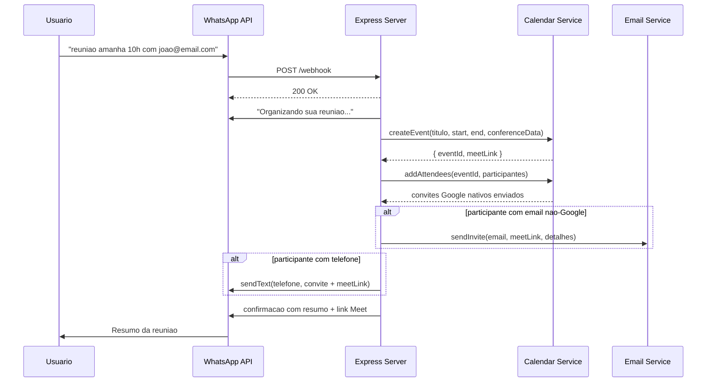
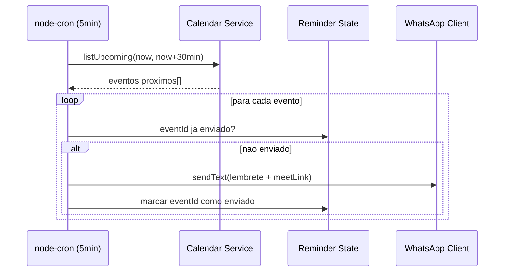
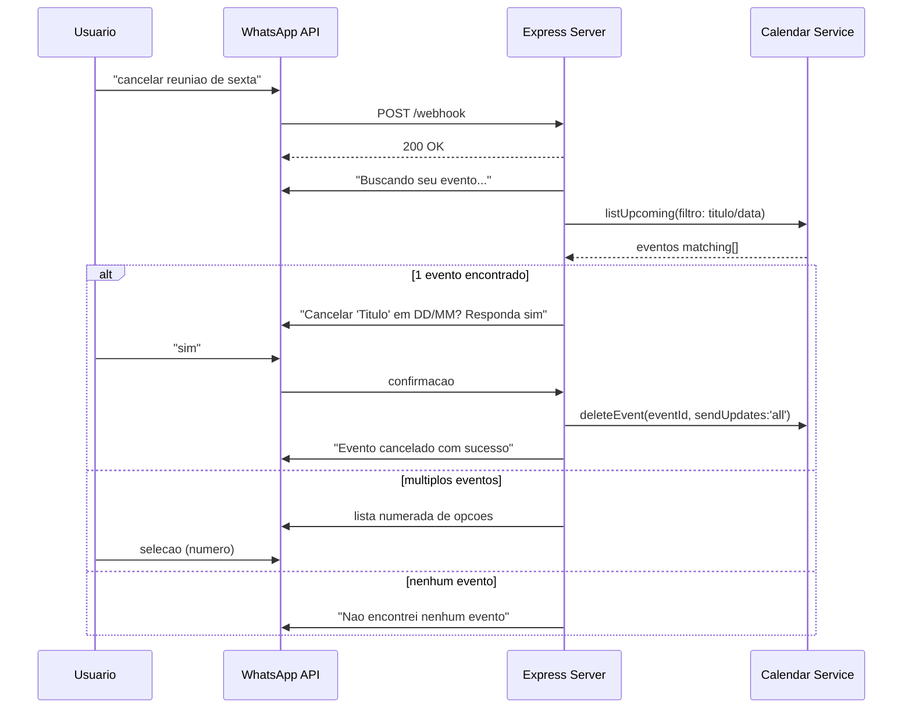

# Assistente Pessoal Inteligente via WhatsApp — Architecture Document

> **Version:** 0.1
> **Date:** 2026-02-16
> **Author:** @architect (Aria)
> **Status:** Draft
> **Inputs:** spec.md, implementation.yaml, requirements.json, research.json, prd.md

---

## 1. Introduction

### 1.1 Project Type

**Greenfield** — Projeto novo, sem codigo existente. Framework AIOS instalado, codigo de aplicacao ainda nao iniciado.

### 1.2 Architecture Scope

Backend-only. Sem frontend — WhatsApp e a interface do usuario. Express server monolito recebendo webhooks e interagindo com APIs externas.

### 1.3 Key Constraints

- Node.js >= 20 LTS com TypeScript strict mode _(CON-1)_
- WhatsApp Business Cloud API v21.0 _(CON-2)_
- Google APIs oficiais (Drive v3, Calendar v3, Gmail) _(CON-3)_
- OpenAI GPT-4o-mini para NLU + Whisper para STT _(CON-4, CON-5)_
- Single-user v1, sem banco de dados _(CON-6)_
- Railway como plataforma de hosting

---

## 2. High Level Architecture

### 2.1 Technical Summary

Sistema backend Node.js/TypeScript que recebe mensagens via WhatsApp webhook, classifica intencoes usando OpenAI GPT (function calling), e executa acoes automatizadas nas APIs do Google (Drive, Calendar, Meet, Gmail). Audio e convertido via ffmpeg + Whisper. Lembretes enviados proativamente via node-cron. Sem banco de dados — sources of truth sao os servicos Google e WhatsApp.

### 2.2 Platform Choice

**Railway** — Justificativa:
- Deploy simples para Node.js (git push → deploy)
- SSL automatico (necessario para webhook HTTPS)
- Always-on service (necessario para node-cron scheduler)
- Free tier para dev, Hobby plan $5/mes para producao
- Logs em tempo real no dashboard
- Restart automatico em crash

**Descartados:**
- Vercel/Netlify: serverless, nao suporta node-cron always-on
- AWS: over-engineering para single-user v1
- VPS: mais manutencao, sem vantagem de custo

### 2.3 Architecture Pattern

**Monolito funcional** — Express server unico com servicos como funcoes exportadas. Adequado para v1 single-user. Sem microservicos, sem filas, sem event bus. Complexidade minima.

### 2.4 Architecture Diagram



### 2.5 Architectural Patterns

| Pattern | Onde | Justificativa |
|---------|-----|--------------|
| Async Webhook | POST /webhook | Responder 200 imediatamente, processar async (NFR-1) |
| Function Calling | intent-classifier | Structured output com schema JSON do GPT |
| Service Functions | src/services/* | Funcoes exportadas, sem classes/DI |
| Centralized Error Handling | error-handler.ts | AppError com userMessage pt-BR |
| Structured Logging | pino | Campos padronizados, redact de tokens |
| Scheduled Jobs | node-cron | Lembretes a cada 5min |

---

## 3. Tech Stack

### 3.1 Production Dependencies

| Package | Version | Purpose |
|---------|---------|---------|
| express | ^4.18.x | Servidor HTTP para webhooks |
| axios | ^1.6.x | REST client para WhatsApp Cloud API |
| googleapis | ^134.0.0 | Cliente oficial Google (Drive, Calendar, Gmail) |
| google-auth-library | ^9.6.x | OAuth 2.0 authentication |
| openai | ^4.x | Cliente oficial OpenAI (GPT + Whisper) |
| nodemailer | ^6.9.x | Envio de emails via Gmail OAuth2 |
| fluent-ffmpeg | ^2.1.x | Conversao audio OGG/Opus → MP3 |
| node-cron | ^3.x | Scheduler para lembretes periodicos |
| pino | ^8.x | Structured logging |
| pino-pretty | ^10.x | Log formatting para desenvolvimento |
| dotenv | ^16.x | Variaveis de ambiente |
| typescript | ^5.3.x | Type safety (build time) |

### 3.2 Development Dependencies

| Type | Package | Version |
|------|---------|---------|
| Types | @types/express, @types/node, @types/nodemailer, @types/fluent-ffmpeg, @types/node-cron | Latest |
| Testing | jest ^29.x, ts-jest ^29.x, @types/jest ^29.x, supertest ^6.x, @types/supertest ^6.x | Latest |
| Dev Server | ts-node-dev ^2.x | Hot reload |
| Lint | eslint, @typescript-eslint/* | Latest |

### 3.3 System Dependencies

| Dependency | Purpose | Install |
|-----------|---------|---------|
| Node.js >= 20 LTS | Runtime | nvm install 20 |
| ffmpeg | Conversao de audio | brew install ffmpeg / apt-get install ffmpeg |
| ngrok (dev only) | HTTPS tunnel para webhook local | brew install ngrok |

### 3.4 N/A Sections (Backend-Only)

- Frontend framework: N/A — WhatsApp e a interface
- CSS/Styling: N/A
- State management: N/A
- Bundler: N/A
- UI component library: N/A

---

## 4. Data Models

### 4.1 Design Decision: Sem Banco de Dados (v1)

Sources of truth sao os servicos externos:
- **Google Calendar** = eventos, reunioes, horarios
- **Google Drive** = arquivos uploadados
- **WhatsApp** = historico de conversas
- **.env** = OAuth refresh token (single user)
- **Memoria** (`Set<eventId>`) = lembretes ja enviados

### 4.2 TypeScript Interfaces

```typescript
// src/types/index.ts

// === Enums ===

export enum Intent {
  UPLOAD_ARQUIVO = 'upload_arquivo',
  CRIAR_EVENTO = 'criar_evento',
  CRIAR_REUNIAO = 'criar_reuniao',
  CANCELAR_EVENTO = 'cancelar_evento',
  AJUDA = 'ajuda',
  CLARIFICACAO = 'clarificacao',
}

export enum MessageType {
  TEXT = 'text',
  AUDIO = 'audio',
  DOCUMENT = 'document',
  IMAGE = 'image',
  UNKNOWN = 'unknown',
}

// === Intent Classification ===

export interface IntentEntities {
  titulo?: string;
  data?: string;          // "amanha", "proxima sexta", "17/02"
  hora?: string;          // "15:00", "tres da tarde"
  duracao?: number;       // minutos (default: 60)
  participantes?: Participant[];
}

export interface Participant {
  nome?: string;
  email?: string;
  telefone?: string;
}

export interface IntentResult {
  intent: Intent;
  entities: IntentEntities;
  confidence: number;     // threshold: 0.7
  rawText: string;
}

// === Incoming Messages ===

export interface IncomingMessage {
  from: string;           // WhatsApp phone number
  type: MessageType;
  text?: string;
  mediaId?: string;
  mimeType?: string;
  filename?: string;
  timestamp: string;
}

// === Service Results ===

export interface CalendarEvent {
  eventId: string;
  title: string;
  startTime: string;      // ISO 8601
  endTime: string;
  meetLink?: string;
  description?: string;
}

export interface DriveUpload {
  fileId: string;
  webViewLink: string;
  folderPath: string;     // ex: "documentos/02-2026/"
  filename: string;
}

// === Reminder State ===

export interface ReminderState {
  sentEventIds: Set<string>;
  lastCheckAt: Date;
}

// === Environment Config ===

export interface EnvConfig {
  // WhatsApp
  WHATSAPP_ACCESS_TOKEN: string;
  WHATSAPP_PHONE_NUMBER_ID: string;
  WEBHOOK_VERIFY_TOKEN: string;
  // Google
  GOOGLE_CLIENT_ID: string;
  GOOGLE_CLIENT_SECRET: string;
  GOOGLE_REDIRECT_URI: string;
  GOOGLE_REFRESH_TOKEN: string;
  // OpenAI
  OPENAI_API_KEY: string;
  // Server
  PORT: number;
  NODE_ENV: 'development' | 'production';
}
```

---

## 5. External APIs

### 5.1 WhatsApp Business Cloud API v21.0

| Endpoint | Method | Purpose |
|----------|--------|---------|
| `graph.facebook.com/v21.0/{PHONE_ID}/messages` | POST | Enviar mensagem de texto |
| `graph.facebook.com/v21.0/{MEDIA_ID}` | GET | Obter URL de download da media |
| `{media_url}` | GET | Download do arquivo binario |

**Auth:** Bearer token (WHATSAPP_ACCESS_TOKEN)
**Timeout:** 10s
**Rate Limit:** Tier 1 = 250 conversas/24h (suficiente para uso pessoal)

### 5.2 Google OAuth 2.0

| Endpoint | Method | Purpose |
|----------|--------|---------|
| `accounts.google.com/o/oauth2/v2/auth` | GET (redirect) | Consent screen |
| `oauth2.googleapis.com/token` | POST | Trocar code por tokens |

**Scopes:** `drive.file`, `calendar`, `gmail.send`
**Flow:** Authorization Code com `access_type: 'offline'`, `prompt: 'consent'`
**Token Refresh:** Automatico via `google-auth-library`

### 5.3 Google Drive API v3

| Endpoint | Method | Purpose |
|----------|--------|---------|
| `drive.files.create` | POST | Upload de arquivo + criacao de pasta |
| `drive.files.list` | GET | Verificar se pasta existe |

**Auth:** OAuth 2.0 Bearer token
**Scope:** `drive.file` (acesso apenas a arquivos criados pelo app)
**Timeout:** 10s

### 5.4 Google Calendar API v3

| Endpoint | Method | Purpose |
|----------|--------|---------|
| `calendar.events.insert` | POST | Criar evento (+ Meet via conferenceData) |
| `calendar.events.delete` | DELETE | Cancelar evento |
| `calendar.events.list` | GET | Listar eventos proximos |

**Auth:** OAuth 2.0 Bearer token
**Timezone:** `America/Sao_Paulo`
**Meet Link:** `conferenceDataVersion: 1` + `conferenceData.createRequest`
**Notificacoes:** `sendUpdates: 'all'` para convites nativos
**Timeout:** 10s

### 5.5 Gmail API (via Nodemailer)

| Transport | Purpose |
|-----------|---------|
| Nodemailer OAuth2 | Envio de convites customizados |

**Auth:** OAuth2 transport com clientId, clientSecret, refreshToken
**Uso:** Convites a nao-Google users e cancelamentos customizados
**Nota:** Calendar `sendUpdates:'all'` ja envia convites Google nativos (OQ-6)
**Timeout:** 10s

### 5.6 OpenAI Chat Completions

| Endpoint | Method | Purpose |
|----------|--------|---------|
| `chat.completions.create` | POST | Intent classification + entity extraction |

**Model:** gpt-4o-mini
**Mode:** Function calling com `strict: true`
**Schema:** `extract_intent` → `{ intent, entities, confidence }`
**System Prompt:** pt-BR com instrucoes de interpretacao de linguagem natural brasileira
**Timeout:** 10s
**Custo:** ~$1.80/mes (estimativa uso pessoal)

### 5.7 OpenAI Whisper (Speech-to-Text)

| Endpoint | Method | Purpose |
|----------|--------|---------|
| `audio.transcriptions.create` | POST | Transcricao de audio |

**Model:** gpt-4o-mini-transcribe
**Language:** `pt`
**Input:** MP3 (convertido de OGG/Opus via ffmpeg)
**Timeout:** 15s
**Custo:** ~$4.50/mes (estimativa uso pessoal)

---

## 6. Core Workflows

### 6.1 Fluxo de Texto (FR-1, FR-4)



### 6.2 Fluxo de Audio (FR-2)



### 6.3 Fluxo de Reuniao (FR-6)



### 6.4 Fluxo de Lembretes (FR-7)



### 6.5 Fluxo de Cancelamento (FR-5, FR-8)



---

## 7. Project Structure

```
assistente-whatsapp/
├── src/
│   ├── server.ts                    # Express server, routes, startup
│   ├── config/
│   │   └── env.ts                   # Env vars validation + typed export
│   ├── types/
│   │   └── index.ts                 # Shared TypeScript types, enums, interfaces
│   ├── webhooks/
│   │   └── whatsapp.handler.ts      # GET verify + POST receive handler
│   ├── services/
│   │   ├── message-router.ts        # Roteia por tipo (text/audio/document) + intent
│   │   ├── intent-classifier.ts     # GPT function calling para NLU
│   │   ├── audio-transcriber.ts     # ffmpeg + Whisper pipeline
│   │   ├── whatsapp.client.ts       # Send messages + download media
│   │   ├── google-auth.ts           # OAuth 2.0 flow + token management
│   │   ├── drive.service.ts         # Upload + auto-organize folders
│   │   ├── calendar.service.ts      # Events CRUD + Meet link
│   │   ├── email.service.ts         # Nodemailer Gmail OAuth2
│   │   └── reminder.scheduler.ts    # node-cron checker + send reminders
│   └── utils/
│       ├── logger.ts                # pino structured logging
│       ├── error-handler.ts         # AppError + handleApiError
│       └── messages.ts              # Centralized pt-BR messages
├── tests/
│   ├── unit/
│   │   ├── intent-classifier.test.ts
│   │   ├── message-router.test.ts
│   │   ├── drive.service.test.ts
│   │   └── calendar.service.test.ts
│   └── integration/
│       ├── webhook.test.ts
│       └── meeting-flow.test.ts
├── package.json
├── tsconfig.json
├── jest.config.ts
├── .env.example
├── .gitignore
└── README.md
```

**~25 arquivos** — Compativel com complexity.dimensions.scope = 5.

### 7.1 Convencoes

- **Servicos:** Funcoes exportadas (`export async function uploadFile(...)`)
- **Tipos:** Centralizados em `src/types/index.ts`
- **Config:** Centralizada em `src/config/env.ts`
- **Testes:** Espelhando estrutura de `src/` em `tests/`

### 7.2 O que NAO existe (e por que)

| Item | Justificativa |
|------|--------------|
| `src/database/` | Sem banco de dados na v1 |
| `src/middleware/` | Express middleware inline (poucos) |
| `src/controllers/` | Sem camada controller — webhook handler chama servicos diretamente |
| `src/models/` | Sem ORM/models — TypeScript interfaces em types/ |
| `public/`, `src/views/` | Sem frontend |
| `docker-compose.yml` | Railway deploy direto (sem Docker) |

---

## 8. Backend Architecture

### 8.1 Service Architecture

**Padrao funcional** — Servicos como funcoes exportadas, nao classes. Sem dependency injection. Import direto entre modulos.

```typescript
// Exemplo: calendar.service.ts
import { getAuthenticatedClient } from './google-auth';
import { CalendarEvent } from '../types';
import { logger } from '../utils/logger';
import { TIMEOUTS } from '../config/env';

export async function createEvent(
  title: string,
  startTime: string,
  endTime: string,
  description?: string,
): Promise<CalendarEvent> {
  const auth = getAuthenticatedClient();
  const calendar = google.calendar({ version: 'v3', auth });
  // ...
}

export async function listUpcoming(
  timeMin: string,
  timeMax: string,
): Promise<CalendarEvent[]> {
  // ...
}

export async function deleteEvent(eventId: string): Promise<void> {
  // ...
}
```

### 8.2 Authentication Flow

```
1. Dev executa GET /auth/google (uma vez)
2. Browser abre Google consent screen
3. Usuario autoriza scopes (drive.file, calendar, gmail.send)
4. Callback GET /auth/google/callback recebe code
5. Troca code por { access_token, refresh_token }
6. Exibe refresh_token na tela → usuario copia para .env
7. Todas as chamadas subsequentes usam getAuthenticatedClient()
8. google-auth-library renova access_token automaticamente via refresh_token
```

### 8.3 Security Layers

| Layer | Implementacao |
|-------|--------------|
| Webhook Verification | `hub.verify_token` check no GET /webhook |
| Token Security | Refresh token em .env, redact em logs via pino |
| Input Validation | Verificacao de payload structure antes de processar |
| API Timeouts | 10-15s por servico, evita hang indefinido |
| Error Isolation | try/catch por servico, erro em um nao derruba outros |
| Scoped OAuth | `drive.file` (apenas arquivos do app), nao `drive` (full access) |

---

## 9. Development Workflow

### 9.1 Prerequisites

- Node.js >= 20 LTS (`nvm install 20`)
- ffmpeg (`brew install ffmpeg`)
- ngrok (`brew install ngrok`) — para webhook local
- Conta Meta Business (WhatsApp API)
- Google Cloud Project com APIs habilitadas
- OpenAI API key

### 9.2 Setup

```bash
# 1. Clone e instale
git clone <repo>
cd assistente-whatsapp
npm install

# 2. Configure variaveis de ambiente
cp .env.example .env
# Preencher todas as variaveis em .env

# 3. Primeira autorizacao Google (uma vez)
npm run dev
# Abrir http://localhost:3000/auth/google no browser
# Copiar refresh_token exibido → colar em .env como GOOGLE_REFRESH_TOKEN

# 4. Configurar webhook WhatsApp
ngrok http 3000
# Copiar URL HTTPS do ngrok → Meta Developers → Webhook URL
```

### 9.3 Scripts (package.json)

```json
{
  "scripts": {
    "dev": "ts-node-dev --respawn --transpile-only src/server.ts",
    "build": "tsc",
    "start": "node dist/server.js",
    "test": "jest",
    "test:unit": "jest tests/unit",
    "test:integration": "jest tests/integration",
    "test:watch": "jest --watch",
    "typecheck": "tsc --noEmit",
    "lint": "eslint src/ tests/"
  }
}
```

### 9.4 Environment Variables

```bash
# .env.example

# WhatsApp Business API
WHATSAPP_ACCESS_TOKEN=           # Meta permanent access token
WHATSAPP_PHONE_NUMBER_ID=        # Phone Number ID do Meta
WEBHOOK_VERIFY_TOKEN=            # Token secreto para webhook verification

# Google OAuth 2.0
GOOGLE_CLIENT_ID=                # OAuth client ID
GOOGLE_CLIENT_SECRET=            # OAuth client secret
GOOGLE_REDIRECT_URI=http://localhost:3000/auth/google/callback
GOOGLE_REFRESH_TOKEN=            # Obtido apos primeira autorizacao

# OpenAI
OPENAI_API_KEY=                  # API key da OpenAI

# Server
PORT=3000
NODE_ENV=development
```

---

## 10. Deployment Architecture

### 10.1 Railway Configuration

```yaml
# railway.toml (ou via dashboard)
[build]
  builder = "NIXPACKS"
  buildCommand = "npm install && npm run build"

[deploy]
  startCommand = "npm start"
  healthcheckPath = "/health"
  healthcheckTimeout = 10
  restartPolicyType = "ON_FAILURE"
  restartPolicyMaxRetries = 3

[service]
  internalPort = 3000
```

**Nixpacks** detecta Node.js automaticamente e instala ffmpeg.

### 10.2 Deploy Flow

```
git push origin main
  → Railway detecta push
  → Nixpacks build (npm install + tsc)
  → Health check GET /health
  → Se 200 OK → deploy ativo
  → Se falha → rollback automatico para versao anterior
```

### 10.3 Environments

| Ambiente | Uso | Hosting |
|----------|-----|---------|
| Local | Desenvolvimento | localhost + ngrok |
| Production | Uso real | Railway Hobby plan |

**Sem staging na v1** — single-user, baixo risco. Testar local → deploy direto.

### 10.4 Cost Breakdown

| Service | Cost/mes | Notas |
|---------|---------|-------|
| Railway Hobby | $5.00 | Always-on, SSL, logs |
| OpenAI GPT-4o-mini | ~$1.80 | ~300 mensagens/mes |
| OpenAI Whisper | ~$4.50 | ~50 audios/mes |
| WhatsApp API | $0.00 | Janela 24h gratuita |
| Google APIs | $0.00 | Quotas gratuitas |
| **Total** | **~$11.30** | |

### 10.5 Rollback Strategy

- Railway mantém historico de deploys
- Rollback via dashboard (1 click) ou CLI (`railway up --detach`)
- Health check garante que deploy quebrado nao fica ativo

---

## 11. Security & Performance

### 11.1 Input Validation

```typescript
// Webhook payload validation
function isValidWebhookPayload(body: any): boolean {
  return (
    body?.entry?.[0]?.changes?.[0]?.value?.messages?.[0] !== undefined
  );
}

// Verificacao de webhook token
function verifyWebhook(query: any): string | null {
  if (query['hub.verify_token'] === env.WEBHOOK_VERIFY_TOKEN) {
    return query['hub.challenge'];
  }
  return null;
}
```

### 11.2 Credential Security

| Credencial | Storage | Access |
|-----------|---------|--------|
| WhatsApp Access Token | .env | process.env |
| Google OAuth Refresh Token | .env | process.env |
| OpenAI API Key | .env | process.env |
| Webhook Verify Token | .env | process.env |

**Regras:**
- `.env` no `.gitignore` — nunca commitado
- pino configurado com `redact: ['*.token', '*.key', '*.secret', '*.refreshToken']`
- Nenhum token em mensagens de erro ao usuario
- Railway env vars configuradas via dashboard (encriptadas)

### 11.3 Threat Model (v1)

| Ameaca | Mitigacao | Risco Residual |
|--------|----------|----------------|
| Webhook spoofing | verify_token check | Baixo (token secreto) |
| Token leaking em logs | pino redact | Baixo |
| Injection via mensagem | GPT processa como NLU, nao executa codigo | Baixo |
| OAuth token theft | .env com permissoes restritas, Railway encrypted vars | Medio |
| DDoS no webhook | Rate limit do WhatsApp API (250/24h) | Baixo |

### 11.4 Latency Budget (NFR-1: < 30s)

```
Pipeline mais longo (audio → reuniao com convites):

[Webhook receive]     ~50ms
[Send "Processando"]  ~200ms (paralelo)
[Download media]      ~1-2s
[ffmpeg convert]      ~500ms
[Whisper transcribe]  ~3-5s
[GPT classify]        ~1-2s
[Calendar create]     ~1-2s
[Email send]          ~1-2s
[WhatsApp confirm]    ~200ms
─────────────────────────────
Total estimado:       ~8-13s  (bem dentro dos 30s)
```

### 11.5 Timeout Strategy

```typescript
export const TIMEOUTS = {
  WHATSAPP_API: 10_000,      // 10s
  OPENAI_GPT: 10_000,        // 10s
  OPENAI_WHISPER: 15_000,    // 15s (audios longos)
  GOOGLE_APIS: 10_000,       // 10s (Drive, Calendar, Gmail)
  NODEMAILER: 10_000,        // 10s
} as const;
```

### 11.6 Memory Management

- Sem acumulo de estado: cada request e independente
- `Set<eventId>` cresce ~30 entries/dia (limpar diariamente ou por data)
- Temp files de audio removidos em `finally` block
- Sem caching em memoria (APIs sao source of truth)

---

## 12. Testing Strategy

### 12.1 Testing Pyramid

```
        /  Manual  \          WhatsApp sandbox
       / Integration \        supertest + mocks
      /   Unit Tests  \       jest + ts-jest + mocks
     ──────────────────
```

- **Unit:** ~30-40 testes — servicos isolados com mocks
- **Integration:** ~6-10 testes — fluxos completos com supertest
- **Manual:** WhatsApp sandbox da Meta — validacao real
- **E2E automatizado:** N/A — WhatsApp Cloud API nao suporta

### 12.2 Unit Tests

```typescript
// tests/unit/intent-classifier.test.ts
describe('Intent Classifier', () => {
  it('classifica "tenho dentista amanha as 15h" como criar_evento', async () => {
    mockOpenAI.chat.completions.create.mockResolvedValue({
      choices: [{ message: { tool_calls: [{ function: {
        arguments: JSON.stringify({
          intent: 'criar_evento',
          entities: { titulo: 'Dentista', data: 'amanha', hora: '15:00' },
          confidence: 0.95,
        })
      }}]}}]
    });

    const result = await classifyIntent('tenho dentista amanha as 15h');
    expect(result.intent).toBe(Intent.CRIAR_EVENTO);
    expect(result.entities.titulo).toBe('Dentista');
    expect(result.confidence).toBeGreaterThan(0.7);
  });

  it('retorna clarificacao para mensagem ambigua', async () => {
    mockOpenAI.chat.completions.create.mockResolvedValue({
      choices: [{ message: { tool_calls: [{ function: {
        arguments: JSON.stringify({
          intent: 'clarificacao',
          entities: {},
          confidence: 0.3,
        })
      }}]}}]
    });

    const result = await classifyIntent('preciso disso');
    expect(result.intent).toBe(Intent.CLARIFICACAO);
  });
});
```

```typescript
// tests/unit/drive.service.test.ts
describe('Drive Service', () => {
  it('cria pasta por tipo e faz upload', async () => {
    mockDrive.files.list.mockResolvedValue({ data: { files: [] } });
    mockDrive.files.create
      .mockResolvedValueOnce({ data: { id: 'folder-123' } })  // criar pasta
      .mockResolvedValueOnce({ data: { id: 'file-456', webViewLink: 'https://...' } });

    const result = await uploadFile(buffer, 'relatorio.pdf', 'application/pdf');
    expect(result.folderPath).toBe('documentos/02-2026/');
    expect(result.fileId).toBe('file-456');
  });
});
```

### 12.3 Integration Tests

```typescript
// tests/integration/webhook.test.ts
import request from 'supertest';
import { app } from '../../src/server';

describe('Webhook Integration', () => {
  it('GET /webhook verifica token e retorna challenge', async () => {
    const res = await request(app).get('/webhook')
      .query({
        'hub.mode': 'subscribe',
        'hub.verify_token': process.env.WEBHOOK_VERIFY_TOKEN,
        'hub.challenge': 'challenge123',
      });
    expect(res.status).toBe(200);
    expect(res.text).toBe('challenge123');
  });

  it('POST /webhook processa mensagem de texto', async () => {
    const res = await request(app).post('/webhook').send({
      entry: [{ changes: [{ value: {
        messages: [{ from: '5511999999999', type: 'text', text: { body: 'ajuda' } }]
      }}]}]
    });
    expect(res.status).toBe(200);
    // Verificar que WhatsApp client foi chamado com resposta de ajuda
  });
});
```

### 12.4 Manual Testing Checklist

- [ ] Enviar texto no WhatsApp sandbox → receber resposta
- [ ] Enviar audio → transcricao + resposta
- [ ] Enviar arquivo → upload no Drive + confirmacao
- [ ] Criar evento via linguagem natural → evento no Calendar
- [ ] Criar reuniao com participante → Meet link + convite
- [ ] Cancelar evento → confirmacao + notificacao
- [ ] Aguardar lembrete de evento proximo → receber no WhatsApp
- [ ] Enviar mensagem ambigua → pedido de clarificacao
- [ ] Simular falha de API → mensagem de erro pt-BR

---

## 13. Coding Standards

### 13.1 Critical Rules

1. **Funcional > OOP** — Servicos como funcoes exportadas, nao classes
2. **TypeScript strict** — Sem `any`, sem `@ts-ignore`, sem `as unknown`
3. **Async/await** — Sem callbacks, sem `.then()` chains
4. **Early return** — Validar e retornar cedo, evitar nesting profundo
5. **Const by default** — Usar `let` apenas quando reatribuicao e necessaria
6. **Template literals** — Para interpolacao, nao concatenacao com `+`
7. **Named exports** — Sem `export default` (melhor tree-shaking e refactoring)

### 13.2 Naming Conventions

| Item | Convention | Exemplo |
|------|-----------|---------|
| Arquivos | kebab-case | `intent-classifier.ts` |
| Funcoes | camelCase | `classifyIntent()` |
| Interfaces | PascalCase | `IntentResult` |
| Enums | PascalCase (enum) + UPPER_SNAKE (values) | `Intent.CRIAR_EVENTO` |
| Constantes | UPPER_SNAKE_CASE | `TIMEOUTS.WHATSAPP_API` |
| Variaveis | camelCase | `const meetLink = ...` |

### 13.3 Code Style

```typescript
// BOM: funcional, claro, tipado
export async function classifyIntent(text: string): Promise<IntentResult> {
  const response = await openai.chat.completions.create({
    model: 'gpt-4o-mini',
    messages: [
      { role: 'system', content: SYSTEM_PROMPT },
      { role: 'user', content: text },
    ],
    tools: [{ type: 'function', function: extractIntentSchema }],
    tool_choice: { type: 'function', function: { name: 'extract_intent' } },
  });

  const toolCall = response.choices[0].message.tool_calls?.[0];
  if (!toolCall) {
    return { intent: Intent.CLARIFICACAO, entities: {}, confidence: 0, rawText: text };
  }

  return JSON.parse(toolCall.function.arguments);
}

// RUIM: classe, any, callback
class IntentClassifierService {
  classify(text: any, callback: Function) { ... }
}
```

---

## 14. Error Handling

### 14.1 AppError Class

```typescript
// src/utils/error-handler.ts

export class AppError extends Error {
  constructor(
    public code: string,
    public statusCode: number,
    public userMessage: string,
    public context?: string,
    public originalError?: Error,
  ) {
    super(userMessage);
    this.name = 'AppError';
  }
}

export function handleApiError(error: unknown, service: string): AppError {
  if (error instanceof AppError) return error;

  const err = error instanceof Error ? error : new Error(String(error));

  // Mapear erros comuns de APIs
  if (err.message.includes('ECONNREFUSED') || err.message.includes('ETIMEDOUT')) {
    return new AppError(
      'SERVICE_UNAVAILABLE',
      503,
      messages.errors.serviceUnavailable,
      service,
      err,
    );
  }

  if (err.message.includes('401') || err.message.includes('403')) {
    return new AppError(
      'AUTH_ERROR',
      401,
      messages.errors.authError,
      service,
      err,
    );
  }

  return new AppError(
    'INTERNAL_ERROR',
    500,
    messages.errors.generic,
    service,
    err,
  );
}
```

### 14.2 Centralized Messages (pt-BR)

```typescript
// src/utils/messages.ts

export const messages = {
  processing: {
    default: 'Processando sua mensagem...',
    audio: 'Processando seu audio...',
    file: 'Processando seu arquivo...',
    event: 'Agendando seu compromisso...',
    meeting: 'Organizando sua reuniao...',
  },

  errors: {
    generic: 'Desculpe, ocorreu um erro. Tente novamente em alguns instantes.',
    calendarUnavailable: 'Nao consegui acessar sua agenda. Tente novamente em alguns minutos.',
    driveUnavailable: 'Nao consegui acessar seu Google Drive. Tente novamente em alguns minutos.',
    whisperFailed: 'Nao consegui entender o audio. Pode enviar por texto?',
    gptFailed: 'Estou com dificuldade para processar sua mensagem. Tente reformular.',
    authError: 'Preciso que voce reconecte sua conta Google. Acesse: {authUrl}',
    serviceUnavailable: 'O servico esta temporariamente indisponivel. Tente novamente em alguns minutos.',
    fileTooLarge: 'O arquivo e muito grande. O limite e de 100MB.',
    invalidEmail: 'O email "{email}" parece invalido. Verifique e tente novamente.',
    eventNotFound: 'Nao encontrei nenhum evento com essa descricao.',
    whatsappError: 'Nao consegui enviar a mensagem. Tente novamente.',
  },

  confirmations: {
    eventCreated: 'Evento "{titulo}" criado para {data} as {hora}.',
    meetingCreated: 'Reuniao "{titulo}" criada para {data} as {hora}.\nLink Meet: {meetLink}\nConvites enviados: {convites}',
    fileUploaded: 'Arquivo "{filename}" salvo em {folderPath}.',
    eventCancelled: 'Evento "{titulo}" cancelado com sucesso.',
    reminder: 'Lembrete: "{titulo}" comeca em {minutos} minutos.{meetLink}',
  },

  prompts: {
    clarification: 'Nao entendi bem. Voce quer:\n1. Agendar um evento\n2. Criar uma reuniao\n3. Salvar um arquivo\n4. Outra coisa',
    cancelConfirm: 'Cancelar "{titulo}" em {data}? Responda "sim" para confirmar.',
    multipleEvents: 'Encontrei {count} eventos. Qual deseja cancelar?\n{lista}',
    conflictWarning: 'Voce ja tem "{existente}" nesse horario. Deseja agendar mesmo assim?',
    pastDate: 'Essa data ja passou. Deseja agendar para a proxima {diaSemana}?',
    help: 'Posso ajudar com:\n- Salvar arquivos no Google Drive\n- Agendar eventos na sua agenda\n- Criar reunioes com link do Meet\n- Cancelar eventos\n- Enviar lembretes de compromissos\n\nE so me dizer o que precisa!',
  },
} as const;
```

### 14.3 Error Recovery

| Erro | Acao | Mensagem ao Usuario |
|------|------|---------------------|
| Google API timeout | Log + notificar | `messages.errors.serviceUnavailable` |
| OAuth token invalido | Log + instrucoes re-auth | `messages.errors.authError` |
| Whisper falha | Log + pedir texto | `messages.errors.whisperFailed` |
| GPT falha | Log + pedir reformulacao | `messages.errors.gptFailed` |
| Drive quota | Log + informar limite | `messages.errors.driveUnavailable` |
| Email invalido | Log + informar quais falharam | `messages.errors.invalidEmail` |
| WhatsApp rate limit | Log + retry no proximo ciclo | Log apenas (retry automatico) |

---

## 15. Monitoring & Observability

### 15.1 Logging Strategy (pino)

```typescript
// Campos padronizados em todos os logs
interface LogContext {
  service: string;       // 'intent-classifier', 'drive', 'calendar', etc.
  action: string;        // 'classify', 'upload', 'createEvent', etc.
  durationMs?: number;   // Tempo da operacao
  intent?: string;       // Intent classificado
  error?: {
    code: string;
    message: string;
  };
}

// Exemplos
logger.info({ service: 'intent-classifier', action: 'classify', intent: 'criar_evento', durationMs: 1250 });
logger.error({ service: 'drive', action: 'upload', error: { code: 'QUOTA_EXCEEDED', message: '...' } });
logger.warn({ service: 'reminder', action: 'check', skipped: true, reason: 'calendar_unavailable' });
```

### 15.2 Health Check

```typescript
// GET /health
{
  status: 'ok',
  uptime: process.uptime(),
  timestamp: new Date().toISOString()
}
```

### 15.3 Railway Observability (incluido no plano)

- Logs em tempo real no dashboard Railway
- Metricas de CPU/memoria do container
- Deploy logs e rollback history
- Restart automatico em crash (maxRetries: 3)

### 15.4 O que NAO temos na v1

| Item | Justificativa |
|------|--------------|
| APM (Datadog, New Relic) | Custo desnecessario para single-user |
| Alertas automaticos | Usuario percebe falhas via WhatsApp (NFR-3) |
| Dashboard de metricas | Logs do Railway cobrem diagnostico basico |
| Distributed tracing | Monolito unico — stack trace do pino e suficiente |

### 15.5 Evolucao Futura (post-MVP)

- `pino-http` para metricas de latencia por rota
- Grafana Cloud (free tier) com metricas custom
- Alertas Slack/email para error rate > threshold

---

## Traceability Matrix

| Architecture Section | Source Documents |
|---------------------|-----------------|
| 1. Introduction | CON-1 to CON-6, project briefing |
| 2. High Level Architecture | spec.md sec 3.1, implementation.yaml OQ-1 |
| 3. Tech Stack | spec.md sec 4.2, implementation.yaml dependencies |
| 4. Data Models | spec.md sec 3.2, requirements.json domainModel |
| 5. External APIs | spec.md sec 4.1, research.json |
| 6. Core Workflows | spec.md sec 3.3, requirements.json interactions |
| 7. Project Structure | spec.md sec 5, implementation.yaml phases |
| 8. Backend Architecture | spec.md sec 3.1-3.2, CON-1 |
| 9. Development Workflow | spec.md sec 10, implementation.yaml |
| 10. Deployment Architecture | implementation.yaml OQ-1, research.json |
| 11. Security & Performance | NFR-1, NFR-3, NFR-4, spec.md sec 3.4 |
| 12. Testing Strategy | spec.md sec 6, prd.md stories ACs |
| 13-14. Coding Standards & Error Handling | CON-1, NFR-3, spec.md sec 3.2 |
| 15. Monitoring & Observability | NFR-3, deployment constraints |

---

## Metadata

- **Generated by:** @architect (Aria) via create-doc (fullstack-architecture-tmpl.yaml v2.0)
- **Inputs:** spec.md, implementation.yaml, requirements.json, research.json, prd.md
- **Spec Pipeline Status:** Complete (6 phases + revision)
- **Architecture Type:** Backend-only monolith (WhatsApp = interface)
- **Database:** None (v1) — sources of truth are Google services
- **Next Workflow Step:** Story Development Cycle — @sm cria stories formais a partir do PRD + esta arquitetura
